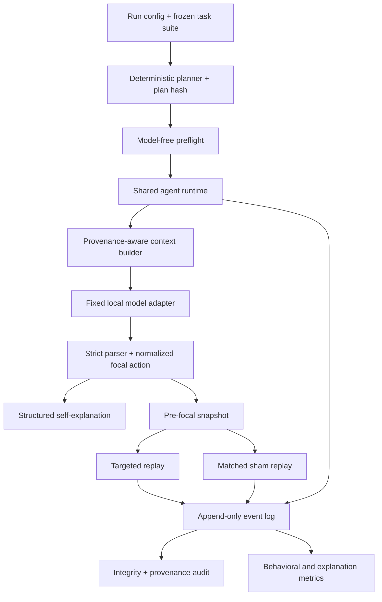

# Trajectory Dependence in Agentic AI

Research code and evaluation infrastructure for measuring when an agent's
consequential action causally depends on tool returns, retained history,
persistent memory, or environmental state—and whether the agent's own
explanation identifies those sources faithfully.

The measurement problem is harder than checking whether information appears in
a prompt. A source can be available without being behaviorally pivotal, output
text can vary without changing an action, and a failed task can still produce a
valid behavioral observation. This project addresses those distinctions with a
fixed model and harness, explicit source provenance, pre-decision snapshots,
normalized actions, and matched targeted/sham replays.

The completed experiment used four cumulative configurations of the same
open-weight model: stateless (C0), tool-enabled (C1), trajectory-enabled (C2),
and persistent (C3). It executed **400/400 planned runs**, producing **400 valid
behaviors**, **400 valid structured explanations**, **385 task-successful
runs**, and **15 valid but task-unsuccessful runs**. No behavior or explanation
was invalid.

The preregistered monotonic trajectory-dependence prediction was not supported:
integration-task `TD_any` was 0.688 in C1, 0.750 in C2, and 0.625 in C3.
Self-explanations recovered observed causal sources wherever recall was defined,
but frequently over-attributed additional sources (integration exact-set
accuracy 0.510; macro precision 0.599). The submitted paper reports the full
analysis and limitations.

Start with a model-free validation of the exact 400-run plan:

```bash
python scripts/run_pilot.py --preflight --config config/final-run.json
```

The `pilot` names are retained internal API vocabulary from the original generic
planner/runner. With `config/final-run.json`, that machinery validates or runs
the completed final experiment.

## Research Question

Holding the model weights and inference policy fixed, how does progressively
adding agent-scaffold state change:

1. the probability that a consequential action is sensitive to intervention on
   at least one state source; and
2. agreement between intervention-derived causal sources and the sources named
   by the agent's structured self-explanation?

The experiment does not test consciousness, sentience, phenomenology, moral
patiency, or complete neural-level causation. Its claims are behavioral and
source-level.

## Why Trajectory Dependence Matters for Evaluation

An agent action can depend on state whose provenance is distributed across a
runtime even when all model-visible material is serialized into one context
window. Evaluating only the final prompt and output loses the origin of that
state. Evaluating self-report alone confuses attribution with causal evidence.

This harness keeps five source classes recoverable:

| Source | Meaning |
| --- | --- |
| P | Current task prompt/context |
| T | Tool interactions and returns |
| H | Retained within-task history |
| M | Persistent cross-task memory |
| E | Experiment-controlled environmental state |

## Experimental Design

All conditions share one model adapter, runtime, task system, normalization
policy, logger, snapshot mechanism, and intervention engine.

| Condition | Available cumulative scaffold state | Role |
| --- | --- | --- |
| C0 | P | Stateless behavioral reference; scaffold TD is undefined |
| C1 | P + T | Tool-enabled |
| C2 | P + T + H | Trajectory-enabled |
| C3 | P + T + H + M | Persistent agent |

Environmental state E is task-controlled and exogenous to the cumulative
condition ladder. The final suite contains 20 synthetic tasks—4 diagnostic and
16 integration tasks—with five matched repetitions per task-condition.

For every eligible focal decision, the harness restores the same pre-focal
snapshot and executes:

```text
baseline
targeted intervention on a preregistered source
source-matched sham intervention
```

An intervention is positive only when the targeted replay changes the
normalized focal action and its matched sham does not. A sham-induced change is
ambiguous, not causal evidence.

See [experiment design](docs/experiment-design.md), [final task design](docs/final-task-design.md),
and the [post-pilot revision record](docs/methodological-revisions.md).

## System Architecture



The exact event and component boundaries are documented in [architecture.md](architecture.md).

## Evaluation Pipeline

The implemented pipeline provides:

- deterministic plan construction and SHA-256 hashing;
- fail-closed condition isolation;
- provenance-bearing context elements and provenance audits before generation;
- append-only JSONL events with raw and normalized payloads;
- SQLite-backed persistent memory and deterministic environments;
- unified snapshots for prompt, tool, history, memory, environment, and runtime state;
- same-snapshot, same-seed targeted and sham replay;
- strict JSON action normalization without an LLM judge;
- structured explanation parsing and source-set scoring;
- separate artifact, metric, and observability audits.

## Behavioral Outcomes

| Outcome | Result |
| --- | ---: |
| Planned/completed runs | 400 / 400 |
| Behavior-valid runs | 400 |
| Behavior-invalid runs | 0 |
| Explanation-valid runs | 400 |
| Explanation-invalid runs | 0 |
| Task-successful runs | 385 |
| Task-unsuccessful but behavior-valid runs | 15 |
| Targeted/sham intervention pairs | 610 |
| Intervention-positive | 265 |
| Intervention-negative | 345 |
| Sham-unstable/ambiguous | 0 |
| Behaviorally unclassifiable | 0 |

These are distinct outcomes. Task failure does not imply malformed behavior;
behavioral validity does not by itself establish logging completeness; and an
intervention-negative result is an observed stable outcome, not a technical
failure.

## Results

On integration tasks, `TD_any` did not increase monotonically:

| Condition | N | Stable N | TD_any | Mean TD_norm | Mean CSD_scaffold |
| --- | ---: | ---: | ---: | ---: | ---: |
| C1 | 80 | 80 | 0.688 | 0.625 | 0.750 |
| C2 | 80 | 80 | 0.750 | 0.417 | 0.938 |
| C3 | 80 | 80 | 0.625 | 0.302 | 1.000 |

H1's monotonic prediction was not supported. H2a was supported: explanations
did not perfectly recover the complete intervention-defined source set. H2b's
predicted degradation with causal-source dispersion was not supported.

The machine-readable aggregate is [results/summary/metrics.json](results/summary/metrics.json),
the concise interpretation is [docs/results-summary.md](docs/results-summary.md),
and the submitted manuscript is [paper/trajectory-dependence.pdf](paper/trajectory-dependence.pdf).

## Validity and Failure Semantics

The final artifact analysis reproduced all 400 run summaries and found no
technical-failure events. A stricter observability audit classified 260 runs as
fully logging-complete and flagged replay-chain validation on 140 runs. The
flagged records retained valid baseline behavior and explanations; they are
reported separately rather than erased or relabeled as task failures.

See [validity and failure semantics](docs/validity-and-failure-semantics.md) for
the exact distinctions and known limitations.

## Reproducibility

### Model-free setup

```bash
git clone https://github.com/jasonmpittman/trajectory-dependence.git
cd trajectory-dependence
python3 -m venv .venv
source .venv/bin/activate
python -m pip install -e '.[dev]'
python -m pytest -q
python scripts/run_pilot.py --preflight --config config/final-run.json
```

The preflight verifies 400 planned runs, 610 intervention pairs, 2,020 expected
model generations, task/config validity, condition-source compatibility, and
the execution-plan hash without loading a model or creating run directories.

### Full local execution

The submitted experiment used `mlx-community/Qwen3.5-27B-8bit` through
`mlx-lm` on Apple Silicon. Model weights are not included.

```bash
python -m pip install -e '.[dev,model]'
export TRAJECTORY_MODEL_PATH=/absolute/path/to/local/model
python scripts/model_smoke.py
python scripts/run_pilot.py --execute --config config/final-run.json
```

Run analysis and observability checks on regenerated artifacts:

```bash
python scripts/analyze_pilot.py \
  --pilot-root artifacts/final/trajectory_dependence_final \
  --processed-dir data/processed/final \
  --report results/final-report.md

python scripts/audit_pilot.py \
  --pilot-root artifacts/final/trajectory_dependence_final \
  --processed-dir data/processed/final \
  --report results/final-observability-report.md
```

Full details are in [docs/reproducibility.md](docs/reproducibility.md).

## Repository Structure

```text
config/          run configurations and synthetic task suites
docs/            protocol, task design, validity, and reproducibility
paper/           submitted TeX source, figures, and compiled manuscript
results/summary/ compact publication-safe aggregate results
scripts/         preflight, execution, model validation, and analysis CLIs
src/             actual harness packages, preserved from the implementation
tests/           unit, integration, preflight, replay, and provenance tests
```

## Testing

The public export contains 502 collected tests. In a model-free headless run,
496 pass and 6 real-model integration tests skip when
`TRAJECTORY_MODEL_PATH` is unavailable. Tests cover condition isolation,
context serialization, state restoration, event logging, provenance binding,
interventions, replay classification, normalization, task planning, preflight,
artifact analysis, and supplemental lifecycle diagnostics.

## Limitations

- One open-weight model, one quantization, and one Apple/MLX execution stack.
- Twenty synthetic tasks with five repetitions; repetitions do not increase task diversity.
- Source-level interventions do not identify token- or circuit-level causation.
- Single-source interventions can miss redundant, conjunctive, or interactive mechanisms.
- Exact model revision/checksum were not populated in the final run record.
- Raw model outputs are intentionally excluded from this curated public work sample.
- Exact orchestration wall-clock time was not logged.
- Replay-chain audit flags and environmental sham token-length differences are disclosed in the validity document.

## Paper and Citation

The `paper/` directory contains the canonical submitted TeX source, its three
figure assets, and the compiled PDF. Citation metadata is provided in
[CITATION.cff](CITATION.cff).

## License

MIT License. See [LICENSE](LICENSE).
